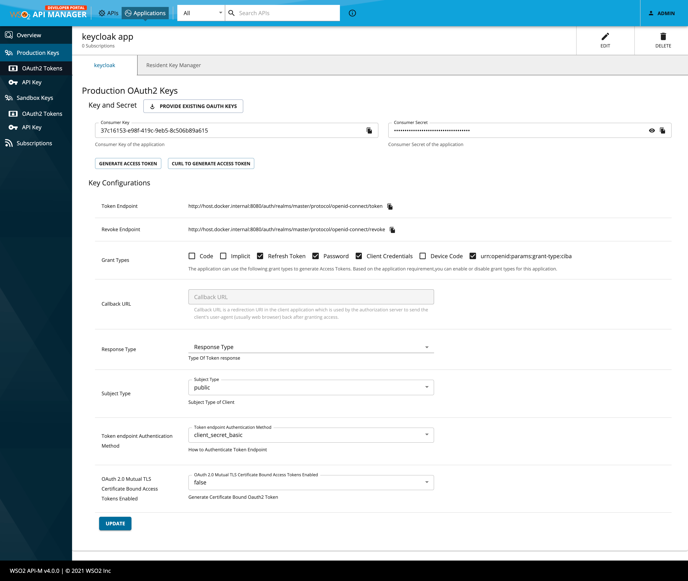

# WSO2 API Manager v4.0.0 with Key Cloak as the Key Manager

This demo configures WSO2 API Manager v4.0.0 with [Key Cloak](https://www.keycloak.org/) as the key manager.

1. login to Keycloak 

admin:admin
http://localhost:8080/auth/admin/master/console/#/realms/master


### Installation Prerequisites

- Docker

#### 1. Start Servers

```
docker compose up
```

#### 2. Configure Key Cloak

- Log into Key Cloak 

    ```
    http://localhost:8080/auth

    Credentials - admin:admin
    ```

- Configure Key Cloak as in https://apim.docs.wso2.com/en/4.0.0/administer/key-managers/configure-keycloak-connector/#step-1-configure-keycloak


#### 3. Configure API Manager

- Log into API Manager

    ```
    https://localhost:9443/admin

    Credentials - admin:admin
    ```

- Add a key manager Key Cloak

    ```
    Well Known URL - http://host.docker.internal:8080/auth/realms/master/.well-known/openid-configuration
    ```

    For more information refer - https://apim.docs.wso2.com/en/4.0.0/administer/key-managers/configure-keycloak-connector/#step-2-configure-wso2-api-manager (You can skip initial 4 steps)


#### 4. Generate Keys 


